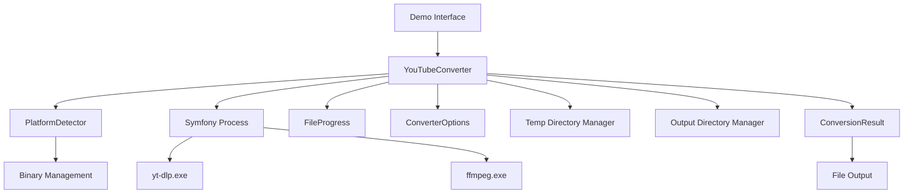

# Design Document

## Overview

Bu tasarım dokümanı, YouTube MP3 dönüştürücü projesindeki Windows platform uyumluluğu sorunlarını ve eksik YouTubeConverter sınıfını çözmek için gerekli mimari ve implementasyon detaylarını içermektedir. Proje, mevcut PlatformDetector altyapısını kullanarak cross-platform binary yönetimi sağlayacak ve Symfony Process bileşeni ile güvenli komut çalıştırma işlemlerini gerçekleştirecektir.

## Architecture

### High-Level Architecture

### Core Components

1. **YouTubeConverter**: Ana dönüştürme sınıfı
2. **PlatformDetector**: Platform-specific binary yönetimi (mevcut)
3. **DirectoryManager**: Temp ve output klasör yönetimi
4. **ProcessManager**: Symfony Process wrapper
5. **ConversionResult**: Dönüştürme sonuç modeli

## Components and Interfaces

### YouTubeConverter Class

Ana dönüştürme işlemlerini yöneten sınıf. Video indirme, format dönüştürme ve progress tracking işlemlerini koordine eder.

### DirectoryManager Class

Temp ve output klasörlerinin oluşturulması, yönetimi ve temizlenmesi işlemlerini gerçekleştirir.

### ProcessManager Class

yt-dlp ve ffmpeg binary'lerinin güvenli şekilde çalıştırılmasını sağlar. Symfony Process bileşenini kullanır.

### ConversionResult Class

Dönüştürme işlemi sonucunda elde edilen bilgileri içeren model sınıfı.

## Data Models

### Video Information Structure

Video bilgilerini içeren veri yapısı:
- Video ID, title, duration
- Thumbnail URL, uploader bilgisi
- Upload date, available formats

### Progress Data Structure

İşlem ilerlemesini takip eden veri yapısı:
- Stage (downloading, converting, completed, error)
- Progress percentage (0-100)
- Status message ve current file bilgisi

## Error Handling

### Exception Hierarchy

ConverterException temel sınıfından türeyen özel exception sınıfları:
- InvalidUrlException: Geçersiz URL hatası
- BinaryNotFoundException: Binary bulunamama hatası
- DirectoryException: Klasör işlem hataları
- ProcessException: Process çalıştırma hataları
- ConversionException: Dönüştürme hataları
- NetworkException: Ağ bağlantı hataları

### Windows-Specific Error Handling

Windows platformuna özel hata yönetimi:
- Path validation (invalid characters, length limits)
- Permission handling
- Binary execution errors
- File system limitations

## Testing Strategy

### Unit Tests

1. **YouTubeConverter Tests**: URL validation, video ID extraction, process flow
2. **DirectoryManager Tests**: Directory creation, permissions, cleanup
3. **ProcessManager Tests**: Binary execution, result handling, timeouts
4. **PlatformDetector Tests**: Windows binary detection, custom paths

### Integration Tests

1. **End-to-End Conversion**: Complete workflow testing
2. **Platform-Specific Tests**: Windows binary execution, path handling
3. **Error Recovery Tests**: Network failures, partial downloads, cleanup

### Mock Strategy

External dependencies için mock interface'ler kullanılacak.

## Implementation Details

### Binary Execution Flow

YouTubeConverter -> ProcessManager -> PlatformDetector -> Symfony Process akışı ile binary'ler güvenli şekilde çalıştırılır.

### Directory Management Flow

Klasör oluşturma, validation ve cleanup işlemleri DirectoryManager tarafından yönetilir.

### Windows-Specific Implementations

1. **Path Normalization**: Forward slash'leri backslash'e çevirme, UNC path desteği
2. **Process Environment Setup**: PATH ve TEMP environment variable'larının ayarlanması
3. **Permission Handling**: Windows file permission kontrolü

### Progress Tracking Integration

FileProgress interface'i kullanarak işlem ilerlemesi takip edilir ve real-time güncellemeler sağlanır.

Bu tasarım, mevcut PlatformDetector altyapısını kullanarak Windows uyumluluğunu sağlarken, eksik YouTubeConverter sınıfını ve gerekli yardımcı sınıfları implement eder.